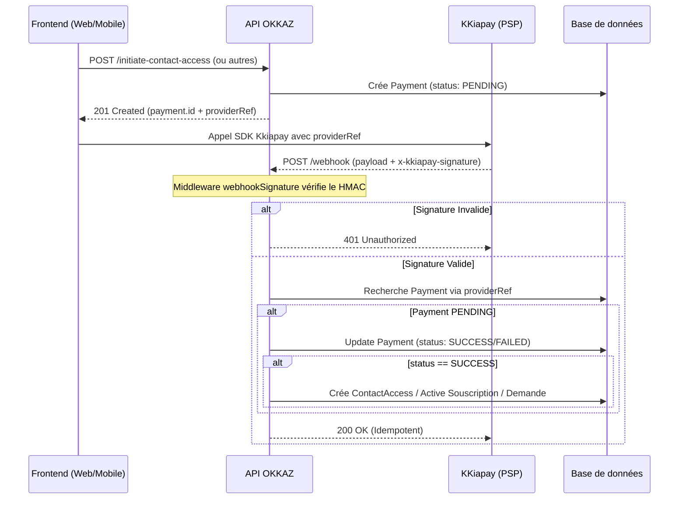

# Module Payments

Le backend OKKAZ a unifiée ses fournisseurs de paiements (PSP : Payment Service Provider) afin d'assurer l'agnosticisme commercial de la logique. Qu'on paie avec *KKiapay*, ou *CinetPay* via du Mobile Money, le cycle de vi est strictement le même.

## Objectifs 

- Facturer l'accès au numéro d'une annonce (`CONTACT_ACCESS`).
- Facturer un boost, c-à-d. une mise en avant d'une annonce (`LISTING_FEATURE`).
- (Optionnellement) Paiements des abonnements Pro (délégués aussi au service subscriptions).

## Diagramme de Flux (Paiement & Webhook)

## Webhooks

C'est ici qu'intervient la vraie magie sécuritaire :
Les paiements ne sont jamais "acquis" localement, ils sont vérifiés au **retour du Provider (Webhook)**. Le `webhookSignature` middleware intercepte la signature HMAC brute et s'assure qu'elle math avec le `.env` `WEBHOOK_SECRET` / `KKIAPAY_WEBHOOK_SECRET`. Sans cette signature le Payload rawBody est renié. Ensuite, la fonction du service s'occupe de déclencher de façon idempotente la transaction prisma pour libérer l'actif (ajout de l'utilisateur à `ListingViews` des contacts débloqués, etc).

